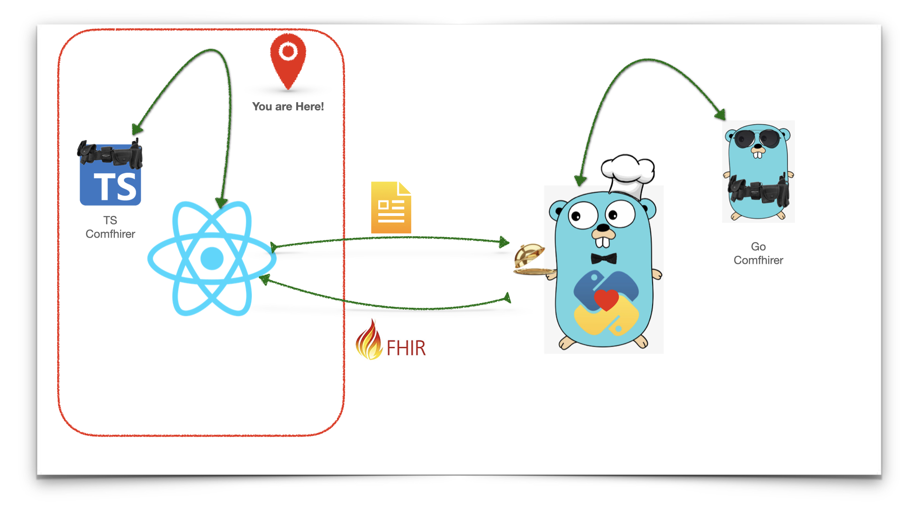
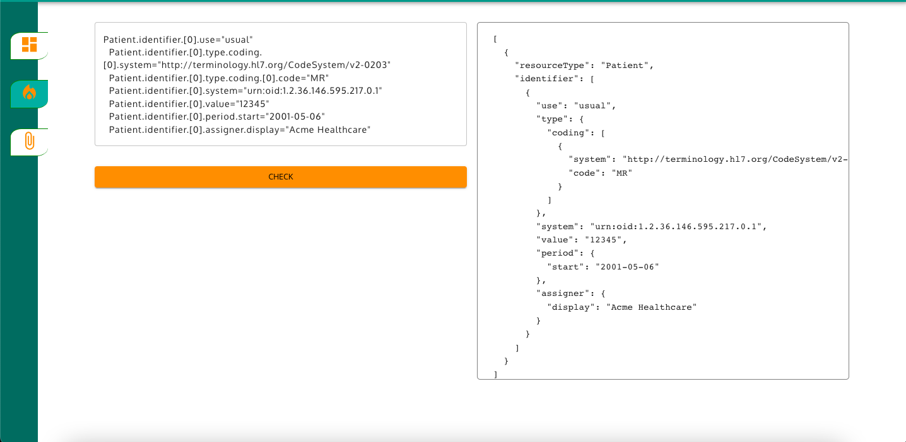
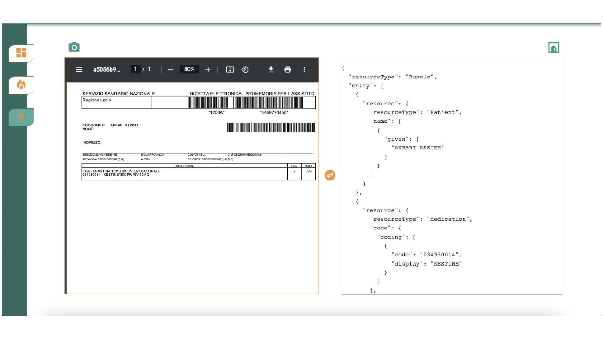

# comfhirer

Comfhirer is a reference implementation which shows the functionalities of the <a href="https://github.com/rzeAkbari/comfhirer-server">Comfhirer-Server</a> project.

It contains a React application and **compiler** library written in **typescript**.

The application consists of three page

- **Dashboard**: future work for the Data engineering part.
- **Caller**: how comfhirer works. A demo of high level flat json syntactical rules and its compilation to Fhir resource. This section uses the compiler written in typescript. To read about the syntactical rules you can checkout the lib <a href="https://github.com/rzeAkbari/comfhirer/tree/main/lib">README</a> file.
  
- **Upload**: A demo of **Comfhirer-server** project. The server must be listening on Port **8080**.
  

## Run

This application support development run. From within **comfhirer-ri** folder:

- npm install
- npm start : app will run on localhost:3000

## Test

Compiler library is writtin in TDD, from withing **lib** folder, you can run the tests following:

- npm install
- npm test
